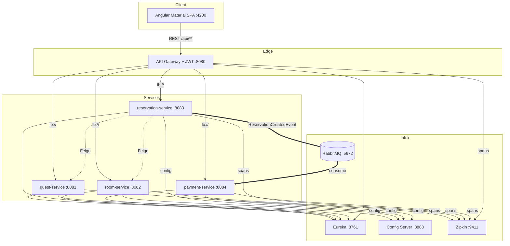

# Izveštaj — Hotel Management mikroservisi

Predmet: PDS. Tema: upravljanje hotelom (sobe, gosti, rezervacije, plaćanja).
Java 17, Spring Boot 3.2.5, Spring Cloud 2023.0.1, PostgreSQL, Angular 17 + Material.

## Cilj

Sistem simulira poslovanje hotela — evidencija gostiju i soba, kreiranje rezervacija sa
proverom dostupnosti i računanjem cene, i automatsko generisanje plaćanja preko asinhronog
događaja. 4 poslovna servisa + infrastruktura (discovery, centralna konfiguracija, gateway,
message broker, tracing).

## Arhitektura

Frontend komunicira isključivo preko API Gateway-a. Gateway proverava JWT i rutira ka servisu
preko Eureka + LoadBalancer (`lb://`). Servisi se pozivaju sinhrono preko Feign-a
(reservation → guest, reservation → room) ili asinhrono preko RabbitMQ (reservation →
payment). Svi se registruju u Eureka-i, deo konfiguracije uzimaju sa Config Servera, a
svaki HTTP hop se prati u Zipkinu.

## Servisi, ukratko

**Eureka Server (8761)** — service discovery, self-preservation isključen u dev-u da
mrtve instance brže nestanu iz liste.

**Config Server (8888)** — native profil, čita iz `config-repo/`. Odatle dolaze npr.
`hotel.payment.tax-rate` i `hotel.guest.loyalty.welcome-points`, plus zajednički deo
konfiguracije (Zipkin, Eureka URL, Actuator).

**API Gateway (8080)** — rute definisane u YAML-u sa `lb://` prefiksom, ujedno OAuth2
Resource Server koji validira HS256 JWT. `/auth/login` generiše token lokalno preko Nimbus
JOSE. Javno: login, `GET /api/rooms/**`, Swagger, Actuator; ostalo traži token. Agregira i
Swagger UI svih servisa u jedan dropdown.

**guest-service (8081)** — CRUD nad gostima, Bean Validation na DTO-ovima, sopstvena baza
(`guestdb`).

**room-service (8082)** — CRUD nad sobama. Status je samo AVAILABLE/MAINTENANCE — govori
da li je soba u funkciji, ne da li je trenutno zauzeta (to odlučuje reservation-service).

**reservation-service (8083)** — najveći deo posla je ovde:
- OpenFeign klijenti (`GuestClient`, `RoomClient`) pozivaju druge servise po imenu, bez
  hardkodovanih URL-ova;
- Resilience4j — Circuit Breaker + Retry sa fallback metodama na svakom Feign pozivu
  (failure-rate 50%, sliding window 10, 3 pokušaja retry-a, konfiguracija u YAML-u);
- pri kreiranju rezervacije povlači gosta i sobu, računa `totalPrice = broj noći × cena`,
  odbija preklapanje sa postojećom rezervacijom (409);
- agregacioni endpointi — `GET /api/reservations/{id}/details` (rezervacija + gost + soba)
  i `GET /api/reservations/guest/{guestId}/details`;
- posle uspešnog `POST /reservations` publikuje `ReservationCreatedEvent`.

**payment-service (8084)** — sluša `ReservationCreatedEvent`, kreira PENDING plaćanje.
Idempotentno preko `unique` na `reservationId`, tako da ponovljena poruka ne pravi duplikat.
PDV se čita iz centralne konfiguracije.

## Komunikacija između servisa

| Od → Do | Kako | Zašto |
|---|---|---|
| reservation → guest | Feign | validacija gosta |
| reservation → room | Feign | dostupnost, cena, status |
| frontend → svi | REST preko gatewaya | UI |
| reservation → payment | RabbitMQ (`hotel.exchange`, `reservation.created`) | auto plaćanje |

Sve sinhrone pozive čuva Resilience4j, pa pad jednog servisa ne obara ceo tok.

## Bezbednost

JWT (HS256) generiše gateway na `/auth/login`, frontend ga drži u localStorage i šalje kroz
interceptor. Postoji bar jedan javan (`GET /api/rooms`) i bar jedan zaštićen endpoint
(`POST /api/reservations`).

## Praćenje rada

Actuator (`/health`, `/info`, `/metrics`, `/prometheus`) na svim servisima. Zipkin
(Micrometer Tracing + Brave) prati zahtev kroz gateway → servis → Feign → drugi servis.
Prometheus registry je spreman za scraping.

## Frontend

SPA sa login-om, shell-om (toolbar + sidenav) i ekranima za sobe, goste, rezervacije,
plaćanja. Rezervacija se kreira kroz dijalog, agregovani prikaz spaja podatke iz više
servisa u jedan poziv ka backendu. Auth guard čuva rute, interceptor dodaje JWT.

## Pokretanje

`docker compose up --build` diže ceo sistem, `--scale room-service=2` demonstrira load
balancing. Detalji (portovi, demo scenario) su u glavnom README-u.

## Zaključak

Sve obavezne tehnologije i sve 4 opcione (Config Server, RabbitMQ, Docker Compose, JWT) su
implementirane, plus par bonus stavki — Zipkin tracing, globalni exception handling,
Prometheus metrike, load balancing. Najviše vremena je otišlo na reservation-service, jer
tu se spaja sinhrona i asinhrona komunikacija sa otpornošću na greške, a najviše
prepravljanja je bilo oko modela zauzetosti soba (v. README, deo "Sobe — status vs
zauzetost").
